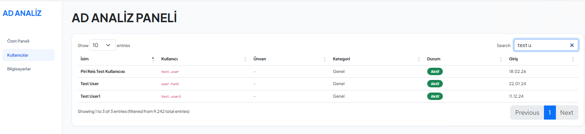
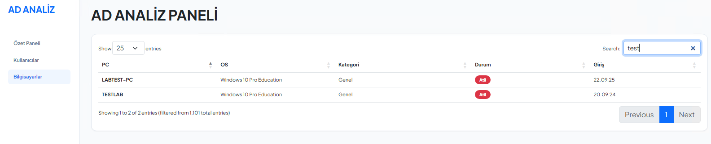

# 🏰 AD ANALİZ PANELİ (v5.3 FORTRESS)

Active Directory yapınızı saniyeler içinde analiz eden ve görsel bir rapor sunan profesyonel bir denetim asistanıdır.

## 🚀 Öne Çıkan Özellikler

- **Modern Dashboard**: Tüm kullanıcı ve bilgisayar verilerini tek bir ekranda, şık bir arayüzle sunar.
- **Güvenlik Odaklı**: Domain adminlerini, atıl (stale) kullanıcıları ve kritik hesapları anında tespit eder.
- **Hiyerarşik Analiz**: OU yapılarını otomatik olarak çözümleyerek departman bazlı raporlama yapar.
- **Hız & Verimlilik**: `ADSI` (LDAP) sorguları sayesinde binlerce kullanıcıyı saniyeler içinde işler.
- **Bağımlılık Yok**: Sadece PowerShell ile çalışır, herhangi bir modül veya harici kütüphane kurulumu gerektirmez.

## 📊 Rapor İçeriği

Üretilen HTML raporu şunları içerir:
- **Kullanıcı İstatistikleri**: Toplam, Aktif, Atıl ve Admin kullanıcı sayıları.
- **Bilgisayar Durumları**: İşletim sistemi bazlı döküm ve son oturum açma tarihleri.
- **Departman Grafikleri**: Organizasyon yapınızdaki dağılımı gösteren dinamik grafikler.

## 🛠️ Nasıl Çalıştırılır?

Bu aracı çalıştırmak için herhangi bir ek yazılım kurmanıza gerek yoktur. Sadece aşağıdaki adımları takip etmeniz yeterlidir:

1.  **Yönetici Olarak Çalıştır:** Başlat menüsüne "PowerShell" yazın, sağ tıklayıp **Yönetici Olarak Çalıştır**'ı seçin.
2.  **Dosya Yoluna Gidin:** Script'in bulunduğu klasöre terminal üzerinden gidin (örneğin: `cd C:\Projeler\AD-Analiz`).
3.  **Çalıştırma Politikası (Gerekirse):** Eğer script'in çalışması engelleniyorsa şu komutu uygulayın:
    ```powershell
    Set-ExecutionPolicy -ExecutionPolicy RemoteSigned -Scope Process
    ```
4.  **Uygulamayı Başlatın:**
    ```powershell
    .\AD-Analiz-Paneli.ps1
    ```
5.  **Sonucu Görüntüleyin:** Analiz tamamlandığında Masaüstünüzde otomatik olarak **`AD-Analiz-Raporu_GG.AA.YYYY.html`** formatında (örneğin: `AD-Analiz-Raporu_03.04.2026.html`) bir dosya oluşacaktır. Bu dosyayı herhangi bir internet tarayıcısı (Chrome, Edge vb.) ile açabilirsiniz.

## 📷 Ekran Görüntüleri

### 👥 Kullanıcı Analizi
Arama ve filtreleme özellikleri sayesinde binlerce kullanıcı arasından istediğiniz veriye anında ulaşın.


### 💻 Bilgisayar Envanteri
İşletim sistemi dağılımı ve aktiflik durumlarını tek bir tabloda görün.


---
*Bu araç, sistem yöneticilerinin günlük kontrollerini hızlandırmak ve Active Directory sağlığını görselleştirmek için geliştirilmiştir.*
